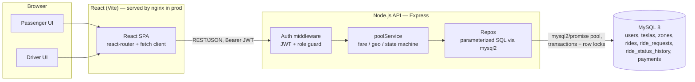
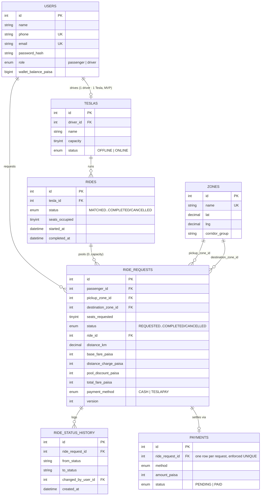
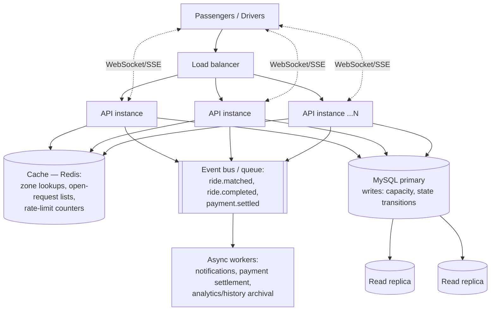

# Dhaka Tesla Pool 🚗⚡

> Share a seat. Split the fare. Survive Dhaka traffic.
---
 **Live Demo:** [Open Dhaka Tesla Pool](https://dhaka-tesla-pool-tawny.vercel.app/)


An MVP ride-pooling app built around three actors — **Passenger** (Nusrat,
Rafiq, Shirin), **Driver/Tesla** (Jashim & his three-seat "Tesla" Bullet),
and the **Ride/Pool** that ties them together for one shared trip.

---

## 1. Summary & Problem Statement

Nusrat wants to get from Banani to Mohakhali. Two minutes later, Rafiq —
a total stranger — requests almost the same route to Gulshan 1. Jashim's
Bullet has three seats. The system has to decide, fast, whether these two
strangers can share a ride, what each of them individually owes, and hold
onto a clear record of what happened once the trip is done — all without
overbooking Bullet, even if a third rider (Shirin) tries to grab the last
seat at the exact same instant someone else does.

That's the whole product problem: **request → pool (when it makes sense)
→ drive → pay → remember**, with individual fares/status per passenger and
capacity that can never be exceeded.

### Features implemented

**Passenger**
- Sign up / sign in (JWT)
- Request a ride: pickup zone, destination zone, seats (1–3)
- See an estimated fare immediately, and the final (possibly pooled) fare
  once a driver accepts
- Track status: `REQUESTED → MATCHED → DRIVER_ARRIVED → STARTED → COMPLETED`
  (+ `CANCELLED`), live via polling
- View full ride history; cancel while the request is still `REQUESTED`
  or `MATCHED`
- Sees only **their own** fare and status, never another passenger's

**Driver / Tesla**
- Sign in; go online / offline
- Owns one Tesla with a fixed seat capacity
- Sees open (unmatched) requests and accepts one into a new or existing pool
- Marks driver-arrived → started → completed for the whole pool
- Sees exactly who's in the car, how many seats are occupied, and full
  ride history for their Tesla

**Pool / Ride Split**
- Multiple requests can share one Tesla when they're "poolable" (see the
  matching rule below)
- Occupied seats can never exceed the Tesla's capacity — enforced with a
  real DB row lock, not just application-level checks (see
  [Concurrency](#9-the-concurrency-problem))
- Each passenger gets an individually calculated fare, recalculated
  whenever the pool's membership changes (someone joins or cancels)
- A full, append-only status history per ride request explains exactly
  what happened after the fact


## 2. Architecture



**Why this shape:** a single Express API and a single MySQL instance is
enough to correctly enforce pooling and capacity for an MVP — see
[Section 9](#9-technology-choice--justification) for why we deliberately
did *not* reach for microservices, Kafka, Kubernetes, Redis, or queues here.

### Entity-Relationship Diagram



Full DDL: [`backend/db/schema.sql`](backend/db/schema.sql). Every table,
constraint, and index is commented in place.

---

## 3. Tech Stack & Justification

| Layer | Choice | Why this fits an MVP ride-pool | Realistic alternative | What would make me switch |
|---|---|---|---|---|
| Frontend | **React + Vite** (plain React, `react-router-dom`) | Fast dev loop, no SSR needed for an authenticated dashboard app, small bundle | Next.js (App Router) | If we needed SSR/SEO for public marketing pages, or file-based routing at scale |
| Backend | **Node.js + Express** | Minimal, unopinionated, the whole team can read every line; async/await maps cleanly onto `mysql2/promise` transactions | NestJS (more structure, DI, decorators), Fastify (faster) | If the team grows and we want enforced module boundaries — NestJS; if raw throughput becomes the bottleneck — Fastify |
| Database | **MySQL 8** (via `mysql2`) | Real ACID transactions + row-level locking (`SELECT ... FOR UPDATE`) are exactly the tool needed for the seat-capacity race condition; relational fits the pooling/capacity relationships naturally | PostgreSQL (arguably better JSON/constraint tooling), SQLite (zero-ops, great for the free-tier deploy story) | If we needed complex partial/JSON constraints or upsert semantics — Postgres |
| ORM/Query layer | **Raw parameterized SQL** via `mysql2/promise`, no ORM | At this schema size (7 tables) a hand-written repo layer is more transparent for a reviewer to audit than an ORM's generated SQL, and it makes the transaction/row-lock logic in `rideRepo.js` explicit rather than hidden behind an ORM's transaction API | Prisma (great DX, migrations, type-safety), Sequelize | The moment the schema grows past ~15 tables or multiple engineers are adding migrations concurrently, I'd move to Prisma for migration tooling and generated types |
| Validation | **Zod** | Schema-first request validation with good TypeScript-adjacent DX even in plain JS | `express-validator`, Joi | No strong reason to switch at this scale |
| Auth | **JWT (bearer) + bcrypt** | Stateless, no session store needed, trivially horizontally scalable | Session cookies + Redis store | If we needed server-side session revocation (logout-everywhere), or first-party web + native app cookie sharing |
| Tests | **Jest** (+ real MySQL/MariaDB for integration tests) | One runner for both unit and integration tests, easy mocking-free style, `supertest`-compatible | Vitest, Mocha+Chai | If migrating the frontend to Vitest anyway, consolidating on one runner |
| Styling | **Hand-written CSS**, no framework | The whole UI is ~4 screens; a utility framework would be overhead for this scope | Tailwind CSS | The moment the design system needs to scale past a handful of screens |
| Hosting | **Docker Compose, self-hosted / local** | Free, reproducible, no vendor lock-in for a take-home; see [Deployment](#8-deployment) for the free-tier constraint we hit | Railway/Render free tier (backend), Vercel (frontend), PlanetScale/Neon (DB) | For a real public deployment with uptime expectations |

### Why raw SQL migrations, not a migration DSL

`backend/db/schema.sql` is loaded once by MySQL's own
`docker-entrypoint-initdb.d` mechanism on first container boot. For an MVP
of this size, one reviewable file *is* the migration — it's exactly what
runs, with no ORM-generated SQL to reverse-engineer. At real-project scale
I'd move to versioned migrations (Prisma Migrate, `node-pg-migrate`,
Flyway) so schema changes are incremental and reversible in production;
documented here as a known limitation, not an oversight.

---

## 4. Geography, matching rule & fare model

### Geography (Section 4)

No map API. Eight predefined Dhaka zones, each a plain `{lat, lng}` point
(`backend/db/seed.sql`), grouped into a `corridor_group`:

| corridor_group | Zones |
|---|---|
| `NE_AIRPORT_ROAD` | Banani, Gulshan 1, Mohakhali, Uttara, Bashundhara |
| `SW_CENTRAL` | Dhanmondi, Mirpur, Farmgate |

Distance between two zones is the **haversine (straight-line) distance
between their coordinates, × a fixed 1.3 detour factor** to roughly
approximate real road distance (`backend/src/services/geoService.js`).
This is a documented simplification, not real routing.

### Matching rule (invented, Section 4)

> Two ride requests are **poolable** when they share the **same pickup
> zone** *and* their destinations belong to the **same `corridor_group`**.

This correctly pools Nusrat (Banani → Mohakhali) with Rafiq (Banani →
Gulshan 1) — both `NE_AIRPORT_ROAD` — while correctly refusing to pool
either of them with a rider requesting Banani → Dhanmondi
(`SW_CENTRAL`). It's intentionally coarse (no detour-distance
optimization); good enough for an MVP, documented as a next improvement.

### Fare model (Section 5)

```
passengerFare = seatsRequested × (baseFare + distanceCharge - poolDiscount)

baseFare       = 3000 paisa                         (flat, 30 BDT, per seat)
distanceCharge = 1500 paisa/km × distanceKm          (rounded to nearest paisa, per seat)
poolDiscount   = 20% × (baseFare + distanceCharge)   if pooled, else 0
```

**Assumption (Section 17):** a passenger booking 2 or 3 seats is occupying
that many of Bullet's seats — capacity that could otherwise have gone to
another pooled rider — so they're charged per seat, not one flat fare
regardless of how many seats they hold.

**Worked example — Nusrat & Rafiq, hand-verifiable:**

| | Route | Distance (haversine × 1.3) | base + distance | pool discount (20%) | **Total fare** |
|---|---|---|---|---|---|
| Nusrat | Banani → Mohakhali | 2.22 km | 3000 + 3330 = 6330 | −1266 | **5064 paisa = ৳50.64** |
| Rafiq | Banani → Gulshan 1 | 2.12 km | 3000 + 3180 = 6180 | −1236 | **4944 paisa = ৳49.44** |

Solo (no pool), the same trips would cost ৳63.30 and ৳61.80 respectively —
the pool discount is the visible incentive to share.

This is unit-tested byte-for-byte in
[`backend/tests/fareService.test.js`](backend/tests/fareService.test.js).

### Money as integer paisa, not decimal

All money is stored and computed as an **integer number of paisa**
(1 BDT = 100 paisa) — e.g. `total_fare_paisa = 5064`, never `50.64` as a
float or SQL `DECIMAL`. Floating-point arithmetic accumulates rounding
error across repeated operations (splitting a pooled fare, applying a
discount, summing history), and BDT has a real smallest unit, so "store
the smallest currency unit as an integer" is the standard pattern here —
identical reasoning to storing USD in cents. The frontend only divides by
100 at the point of display (`frontend/src/utils/money.js`).

### Payment

Cash or a simulated **TeslaPay** wallet (`payment_method` on each
request, `wallet_balance_paisa` on the user, a `payments` row created when
a ride completes). No real payment gateway — this is explicitly out of
scope per the brief.

---

## 5. Ride / Pool Lifecycle

```
REQUESTED → MATCHED → DRIVER_ARRIVED → STARTED → COMPLETED
REQUESTED → CANCELLED
MATCHED   → CANCELLED
```

We kept the suggested lifecycle as-is (`backend/src/services/stateMachine.js`
encodes it as an explicit allowed-transitions table — any other jump is
rejected with `409 INVALID_TRANSITION`). One documented assumption:

> **Cancellation is only allowed through `MATCHED`.** Once the driver has
> arrived (`DRIVER_ARRIVED`), the passenger can no longer self-cancel —
> Bullet has already made the trip to the pickup zone. This mirrors how
> most real ride-hailing apps treat "driver arrived" as the point where
> cancellation starts costing something. A driver can still cancel a
> no-show at `DRIVER_ARRIVED` (a separate, driver-only path).

The **ride/pool** (`rides` table) has its own, slightly coarser status
that every non-cancelled member's request mirrors once matched. When the
driver marks arrive/start/complete, it cascades to every active passenger
in the pool in one transaction — nobody's status can silently drift out of
sync with the car they're sitting in.

---

## 6. The Concurrency Problem

**Scenario (Section 12):** Bullet has 1 seat left. Two requests try to
claim it at nearly the same instant, and both read "1 seat available"
before either write happens.

**How it's handled now:** `rideRepo.attachRequestToRide` runs inside a
single DB transaction that does:

```sql
SELECT * FROM rides WHERE id = ? FOR UPDATE;   -- takes a row lock
-- check seats_occupied + seats_requested <= capacity
UPDATE rides SET seats_occupied = seats_occupied + ? WHERE id = ?;
UPDATE ride_requests SET ride_id = ?, status = 'MATCHED' WHERE id = ? AND status = 'REQUESTED';
COMMIT;
```

`SELECT ... FOR UPDATE` takes an InnoDB row lock on that specific `rides`
row. If two accept calls race, the **second transaction physically
blocks** at that `SELECT` until the first commits — it then re-reads the
now-updated `seats_occupied`, fails the capacity check, and the API
returns a clean `409 SEAT_UNAVAILABLE` instead of overbooking. This isn't
simulated — it's proven with a real concurrent test against a live MySQL
instance:
[`backend/tests/integration.pool.test.js`](backend/tests/integration.pool.test.js)
fires two `driverAcceptRequest` calls with `Promise.allSettled` at the
same instant for the last seat and asserts exactly one wins.

As a second line of defense, `ride_requests.version` supports optimistic
locking (`WHERE id = ? AND status = 'REQUESTED'` is itself a
compare-and-swap — zero affected rows means someone else already changed
it, and the caller gets `409 REQUEST_UNAVAILABLE`).

**What I'd change at larger scale:** a single-row `FOR UPDATE` is fine at
MVP traffic but becomes a hot lock under real concurrency (many drivers,
many pools, high request rate on the same few popular pickup zones). At
scale I'd move the "does this pool have a free seat" check to something
that doesn't hold a transactional row lock for the write's duration —
e.g. an atomic `UPDATE rides SET seats_occupied = seats_occupied + ? WHERE id = ? AND seats_occupied + ? <= capacity`
(single atomic statement, no explicit lock window) with the row lock only
as a fallback, or push seat reservation into a dedicated fast store
(Redis `INCR`/Lua script) with the relational DB as the durable
system-of-record written asynchronously. I'd also add idempotency keys on
the accept endpoint so a retried request from a flaky client can't
double-accept.

---

## 7. Local Setup

### Prerequisites
- Docker & Docker Compose (recommended path), **or**
- Node.js 20+, MySQL 8/MariaDB 10+ (running everything without Docker)

### Option A — Docker (recommended)

```bash
git clone <this-repo-url>
cd dhaka-tesla-pool
cp .env.example .env          # edit values if you like; demo values work as-is
docker compose up --build
```

- Frontend: http://localhost:3000
- Backend API: http://localhost:4000 (health check at `/health`)
- MySQL: localhost:3306 (schema + seed data load automatically on first boot)

### Option B — Without Docker

```bash
# 1. Start MySQL/MariaDB locally, then:
mysql -u root -p -e "CREATE DATABASE dhaka_tesla_pool;"
mysql -u root -p dhaka_tesla_pool < backend/db/schema.sql
mysql -u root -p dhaka_tesla_pool < backend/db/seed.sql

# 2. Backend
cd backend
cp .env.example .env   # or export the DB_* vars from the root .env.example
npm install
npm run dev             # http://localhost:4000

# 3. Frontend (separate terminal)
cd frontend
npm install
npm run dev              # http://localhost:3000, proxies to VITE_API_URL
```

### Running tests

```bash
cd backend
npm install
npm test                 # unit tests only — no DB required (fare, geo, state machine)
# For the DB-backed tests (capacity, concurrency, ownership, cancellation):
#   point DB_* at a running MySQL (docker compose up -d mysql is enough), then:
npm run test:integration
```

### Demo credentials

All demo accounts use the password **`password123`**.

| Name | Phone | Role |
|---|---|---|
| Jashim Uddin | `01710000001` | driver (owns **Bullet**, 3 seats) |
| Nusrat Jahan | `01710000002` | passenger |
| Rafiq Islam | `01710000003` | passenger |
| Shirin Akter | `01710000004` | passenger |

Suggested demo flow: sign in as **Jashim**, go online. In another
browser/tab sign in as **Nusrat**, request Banani → Mohakhali. As
**Rafiq**, request Banani → Gulshan 1. Back as Jashim, accept both — watch
them land in the same pool with the pool discount applied — then arrive /
start / complete.

---

## 8. Deployment

The application is deployed using free-tier services:

- **Frontend:** Vercel
- **Backend/API:** Render
- **Database:** Aiven MySQL

The deployed frontend communicates with the Express backend hosted on Render, while the backend connects to the Aiven MySQL database.

For local development and reproducibility, the complete stack can still be started using:


### API overview

All endpoints are JSON over REST, prefixed `/api`. Full route list:

| Method | Path | Who | What |
|---|---|---|---|
| POST | `/auth/signup` | anyone | Create a passenger or driver account (driver signup also creates their Tesla) |
| POST | `/auth/signin` | anyone | Get a JWT |
| GET | `/zones` | authenticated | List the predefined Dhaka zones |
| POST | `/rides` | passenger | Request a ride (pickup, destination, seats) |
| GET | `/rides` | passenger | Own ride history |
| GET | `/rides/:id` | passenger (owner only) | One request's status/fare |
| POST | `/rides/:id/cancel` | passenger (owner only) | Cancel while `REQUESTED`/`MATCHED` |
| POST | `/driver/status` | driver | Go `ONLINE`/`OFFLINE` |
| GET | `/driver/me` | driver | Own Tesla |
| GET | `/driver/requests` | driver | Open (unmatched) requests |
| POST | `/driver/requests/:id/accept` | driver | Accept into a new or existing pool |
| GET | `/driver/rides/:id` | driver (owner only) | Pool detail: members, seats, status |
| GET | `/driver/rides` | driver | Own ride/pool history |
| POST | `/driver/rides/:id/arrive` \| `/start` \| `/complete` | driver (owner only) | Advance the whole pool |

REST was chosen over GraphQL because the resource shape here is simple and
mostly hierarchical (a user has rides, a ride has members) — GraphQL's
main win (flexible client-driven queries, avoiding over/under-fetching)
doesn't pay for itself at 13 endpoints and one frontend consumer.

### Key decisions & trade-offs
- **One driver : one Tesla** (not a fleet model) — simplifies the schema
  significantly and matches the brief (Jashim *is* Bullet's driver); a
  real fleet product would need a separate `driver_tesla_assignments`
  history table.
- **Pooling is driver-initiated ("accept"), not fully automatic** — the
  brief explicitly asks for a driver who "sees relevant requests" and
  "accepts a ride/pool," so the system surfaces poolable candidates but a
  human makes the call, rather than silently auto-assigning riders to
  cars.
- **Fares recompute on every pool membership change** — simplest way to
  guarantee "individual fare, always correct," at the cost of a few extra
  writes per join/cancel. At scale this could be event-driven instead of
  synchronous.
- **JWT with no server-side revocation** — simplest auth that satisfies
  "sign up/in," acceptable for an MVP; a production system handling
  driver suspensions etc. would want short-lived access tokens + refresh
  tokens or a revocation list.

### Known limitations
- Corridor-group matching is coarse (whole-zone groups, not real
  detour-distance optimization) — see [Bonus](#10-if-oi-tesla-goes-viral--scaling-reasoning) for how this evolves.
- No ratings, no real payment gateway, no push notifications — frontend
  polls every 5s instead of websockets/SSE.
- One Tesla per driver; no multi-vehicle fleets.
- No rate limiting or request idempotency keys yet (called out in
  Concurrency and the scaling section).

### Next improvements
- Idempotency keys on `accept`/`cancel` so retried requests are safe.
- Replace polling with SSE/WebSocket for live status.
- Real routing distance (OSRM or a maps API) instead of the haversine
  approximation.
- Driver ratings + passenger ratings.
- Refresh tokens / revocation for JWT.

---

## 9. AI Usage

AI tools (this assistant, used conversationally through the build) were
used throughout — scaffolding the schema, writing the Express routes and
React components, and drafting this README — per the brief's Section 8
policy. Everything below was reviewed, run, and in several cases debugged
by hand before being kept.

**One accepted suggestion:** using `SELECT ... FOR UPDATE` inside an
explicit transaction to serialize the last-seat race, rather than an
application-level "check-then-write" — this is the correct MySQL/InnoDB
primitive for the exact race condition the brief describes, and it's
provable with a real concurrent test rather than trusted by argument.

**One rejected/changed suggestion:** the first draft read a freshly
inserted row back through the shared connection pool *inside* the same
transaction that inserted it (`pool.query(...)` instead of
`conn.query(...)`). Under MySQL's default `REPEATABLE READ` isolation
that second connection can't see the uncommitted row, so every fresh ride
request silently came back `null`. This was caught by the integration
test suite (not by inspection), fixed by reading back on the *same*
connection/transaction instead of the pool
(`backend/src/repos/rideRepo.js`, `findRequestByIdWith`) — see the
`test(pool)` commit for the full writeup. A second, related bug from the
same review pass: `getRideMembers` wasn't selecting
`destination_corridor_group`, so the pooling-compatibility check silently
failed and every request opened its own pool instead of joining an
existing one — also caught by the integration tests, not by hand-reading
the code.

### Demo video
(https://drive.google.com/file/d/1ZYMje9D_oJlelMciOiIJfeaXpe1YaaVh/view?usp=drive_link)

---

## 10. "If Oi Tesla Goes Viral" — scaling reasoning (bonus)

Reasoning through 1M passengers / 100k drivers **without** over-building
the MVP:



- **Load balancing / horizontal scaling:** stateless API (JWT, no sticky
  sessions) behind a load balancer, scaled by instance count; the DB
  becomes the shared bottleneck to manage, not the API tier.
- **DB indexing / read replicas:** the current indexes
  (`ride_requests.status`, `.passenger_id`, `.ride_id`,
  `rides.(tesla_id,status)`) cover the MVP's query patterns; at scale,
  route read-heavy queries (ride history, "my rides") to replicas and
  keep the capacity-critical write path (accept/cancel) on the primary
  only.
- **Caching:** zones/corridor data is near-static — cache it entirely;
  cache "open requests near driver" lists with short TTLs; use a cache
  for rate-limit counters.
- **Geospatial search:** the corridor-group approach doesn't scale to a
  real city-wide market — replace with a geospatial index (MySQL spatial
  types, PostGIS, or a dedicated geo service like Uber's H3) so
  "poolable" becomes a radius/detour query, not a hardcoded zone table.
- **Queues/events:** ride state transitions (`matched`, `completed`)
  become events on a queue (SQS/Kafka/RabbitMQ) so notification, payment
  settlement, and analytics are async consumers instead of blocking the
  request path — this is where a queue earns its complexity, unlike in
  the MVP where it would just be ceremony.
- **Real-time communication:** replace the frontend's 5s polling with
  WebSockets/SSE per driver and per passenger so status/pool updates are
  push-based, not pulled.
- **Rate limiting & idempotency:** rate-limit request/accept endpoints
  per user; require an idempotency key on `accept`/`cancel` so a retried
  request from a flaky mobile connection can't double-act.
- **Observability:** structured logs + request IDs threaded through
  (already logged centrally in `errorHandler.js` — extend with a
  correlation ID), metrics on match latency and pool-fill rate, alerting
  on capacity-check failures/lock contention.
- **DB contention:** the single-row `FOR UPDATE` lock that's correct at
  MVP scale becomes a real hot-spot under high concurrent demand on
  popular pickup zones — see the mitigation discussed in
  [Concurrency](#6-the-concurrency-problem) (atomic conditional `UPDATE`,
  or a fast in-memory seat-reservation layer with the relational DB as
  durable system-of-record).
- **Ride matching:** move from "driver browses and accepts" to a matching
  service that proactively assigns compatible waiting requests to nearby
  online Teslas — still human-confirmable, but algorithmically suggested
  rather than driver-searched.
- **Retry/failure strategy:** idempotent writes + exponential backoff on
  the client; a dead-letter queue for events that fail to process after
  retries, with alerting.
- **Security:** short-lived JWTs + refresh tokens, per-endpoint rate
  limiting, input validation at every boundary (already in place via
  Zod), secrets in a real secrets manager (not `.env`) in production.
- **Deployment strategy:** blue/green or rolling deploys behind the load
  balancer, DB migrations run as a separate, reversible step before
  traffic shifts, feature flags for risky changes (e.g. a new matching
  algorithm).

None of this is in the MVP on purpose — Section 9 of the brief explicitly
warns against adding Kafka/Kubernetes/Redis/queues "just to look
advanced." The MVP's single Express instance + single MySQL + row locks
is the right amount of complexity for the traffic it actually needs to
handle today.

---

## 11. Project Structure

```
dhaka-tesla-pool/
├── docker-compose.yml
├── .env.example
├── backend/
│   ├── db/
│   │   ├── schema.sql          # full DDL, commented
│   │   └── seed.sql            # story cast + zones
│   ├── src/
│   │   ├── config/db.js        # mysql2 pool + withTransaction helper
│   │   ├── middleware/         # auth (JWT + role), error handler
│   │   ├── repos/              # parameterized SQL, one file per entity
│   │   ├── services/           # geoService, fareService, stateMachine, poolService
│   │   ├── routes/             # authRoutes, zoneRoutes, rideRoutes, driverRoutes
│   │   └── app.js / server.js
│   ├── tests/                  # unit (no DB) + integration (real MySQL)
│   └── Dockerfile
└── frontend/
    ├── src/
    │   ├── api/client.js       # fetch wrapper + JWT
    │   ├── context/AuthContext.jsx
    │   ├── pages/               # AuthPage, PassengerDashboard, DriverDashboard
    │   └── components/StatusBadge.jsx
    └── Dockerfile
```

## Git Workflow

`master` ← `pre-release` ← `release/v1.0.0`, built from individual
`feature/*` branches (`feature/db-schema`, `feature/passenger-auth`,
`feature/tesla-pooling`, `feature/driver-flow`, `feature/backend-tests`,
`feature/frontend`, `feature/docker-deploy`, `feature/docs`), each merged
into `master` once working. `git log --oneline --graph --all` shows the
full sequence, including the two real bugs the integration test suite
caught and fixed (see the `test(pool)` commit).
